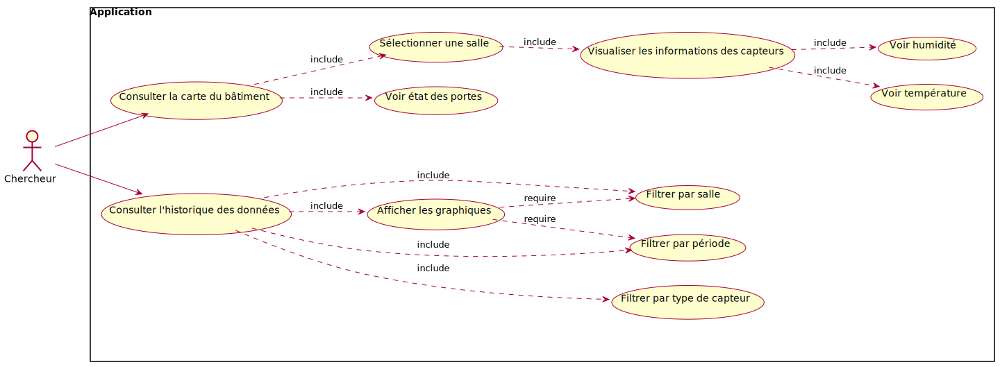
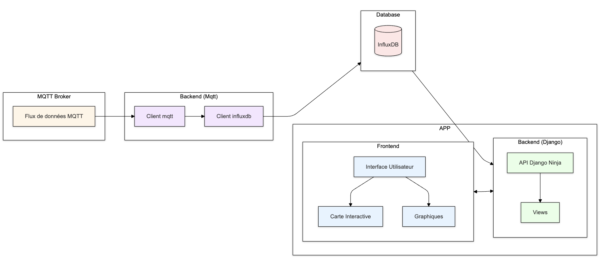

# Documentation Technique - Recherches DashBoard

## Sommaire

- [Documentation Technique - Recherches DashBoard](#documentation-technique---recherches-dashboard)
  - [Sommaire](#sommaire)
  - [I. Introduction](#i-introduction)
  - [II. Présentation de l'application](#ii-présentation-de-lapplication)
    - [1. Cas d'utilisation](#1-cas-dutilisation)
    - [2. Diagramme de classes](#2-diagramme-de-classes)
  - [III. Architecture](#iii-architecture)
    - [1. Architecture de l'application](#1-architecture-de-lapplication)
  - [IV. Fonctionnalités de l'application](#iv-fonctionnalités-de-lapplication)
  - [V. Routes API](#v-routes-api)
  - [VI. Structure du Projet](#vi-structure-du-projet)
  - [VII. Technologies Utilisées](#vii-technologies-utilisées)


---

## I. Introduction

Cette application web a été développée pour le bâtiment de recherche afin de permettre aux chercheurs de surveiller l'état des capteurs des différentes salles. L'application s'inscrit dans un contexte de recherche où une surveillance précise des conditions environnementales est essentielle pour garantir la validité des expériences.


## II. Présentation de l'application

### 1. Cas d'utilisation

L'application permet aux chercheurs de :
- Naviguer sur la carte interactive du bâtiment
- Consulter les données en temps réel des capteurs par salle
- Visualiser l'état des portes (ouvert/fermé)
- Analyser l'historique des données via des graphiques
- Filtrer les données selon la salle, le type de données et une période donnée  
<br>




## III. Architecture

### 3.1. Architecture de l'application

L’architecture de l’application repose sur plusieurs modules interconnectés :
- Un système MQTT pour la collecte des données
- Une base de données InfluxDB pour le stockage des données sous forme de séries temporelles
- Un backend Django pour le traitement (récupérer et filtrer les données) servant de liaison entre la BD et le frontend
- Une interface frontend interactive pour la visualisation
<br>



## IV. Fonctionnalités de l'application

### 4.1 Carte interactive
#### 4.1.1 Visualisation de la carte
- Affichage du plan du bâtiment
- Interaction avec les salles via des clics
- Pop-ups d'information pour chaque salle
- Indication visuelle de l'état des portes

#### 4.1.2 Visualisation des données en temps réel
- Température
- Humidité
- État des portes
- Mise à jour automatique des données


### 4.2 Interface d'historique
#### 4.2.1 Système de filtres
- Sélection de salle
- Type de capteur
- Période temporelle

#### 4.2.2 Visualisation graphique
- Affichage des graphiques des données sélectionnées


## V. Routes API

### 1. Récupération des Dernières Données de Capteurs

#### `GET /api/sensors`

- **Description** : Récupère les dernières données de tous les capteurs

### 2. Requête Dynamique MQTT

#### `GET /api/sensors/mqtt/{path:path}`

- **Description** : Route dynamique pour requêtes flexibles
- **Paramètres** : Chemin dynamique permettant des filtres multiples

### 3. Récupération par Salles

#### `GET /api/sensors/rooms`

- **Description** : Récupère les données des capteurs pour les pièces spécifiées
- **Paramètres optionnels** :
  - `room_ids` : Liste des identifiants de salles
  - `sensor_id` : Filtrage par ID de capteur
  - `sensor_type` : Filtrage par type de capteur
  - `field` : Filtrage par champ spécifique
  - `start_time` : Début de la plage temporelle
  - `end_time` : Fin de la plage temporelle

### 4. Données d'une Salle Spécifique

#### `GET /api/sensors/{room_id}`

- **Description** : Récupère les données des capteurs d'une salle
- **Paramètres optionnels** :
  - `room_id` : Identifiant de la salle
  - `sensor_id` : Filtrage par ID de capteur
  - `sensor_type` : Filtrage par type de capteur
  - `field` : Filtrage par champ spécifique
  - `start_time` : Début de la plage temporelle
  - `end_time` : Fin de la plage temporelle

### 5. Types de Capteurs

#### `GET /api/sensor_types`

- **Description** : Récupère tous les types de capteurs


## VI. Structure du Projet

```
backend/
├── backend/
├── services/
│   └── influxdb_client_django.py
├── theme/
│   ├── static/                    # Fichier static 
│   │   ├── carte.svg
│   │   └── scripts.js             # Fichiers JavaScript
│   ├── templates/                 # HTML templates
│   │   ├── base.html
│   │   ├── historique.html
│   │   └── tmap.html
├── web/                           # Routage des pages web
└── webapi/                        # API entre InfluxDB et UI
```

## VII. Technologies Utilisées

- Django
- Django Ninja
- InfluxDB
- MQTT
- JavaScript
- Chart.js


