# Documentation Utilisateur - Recherches DashBoard

## Sommaire
- [Documentation Utilisateur - Recherches DashBoard](#documentation-utilisateur---recherches-dashboard)
  - [Sommaire](#sommaire)
  - [I. Introduction](#i-introduction)
  - [II. Présentation de l'Application](#ii-présentation-de-lapplication)
  - [III. Installation de l'Application](#iii-installation-de-lapplication)
  - [IV. Navigation dans l'Application](#iv-navigation-dans-lapplication)
    - [1. Page avec la carte](#1-page-avec-la-carte)
    - [2. Page Historique](#2-page-historique)
  - [V. Guide pour ajouter une salle dans l'Application](#iv-guide-pour-ajouter-une-salle-dans-lapplication)

_Créé par : Naïla Bon et Ophélie Winterhoff_

_A destination de : Cassandre Vey, Esther Pendaries et Rémi Boulle_


---

## I. Introduction
Ce document a été rédigé dans le cadre de la création d'une application permettant de suivre l'état des capteurs installés dans le bâtiment de recherches de l'IUT de Blagnac, du point de vue de l'utilisateur.

## II. Présentation de l'Application
L'application offre la possibilité de surveiller en temps réel, ou à un moment précis, l'état des capteurs du bâtiment de recherches de l'IUT de Blagnac. Ces capteurs mesurent plusieurs paramètres : **Température**, **Humidité**, **État des ouvertures et fermetures des portes** dans les différentes salles du bâtiment.


## III. Installation de l'Application
**Prérequis :**
- **Docker** et **Docker Compose** doivent être préalablement installés sur la machine
- **InfluxDB** sera automatiquement déployé via Docker

**Instructions d'installation**
1. Clonez le repository :
   
   ```bash
   git clone https://github.com/IUT-Blagnac/SAE-ALT-S3-Dev-24-25-DB-Recherche-Equipe-3A02.git
2. Allez dans le répertoire du projet : 
   
   ```bash
   cd SAE-ALT-S3-Dev-24-25-DB-Recherche-Equipe-3A02
3. Lancez les conteneurs Docker : 

    ```bash
    docker-compose up
4. L'application sera accessible aux adresses suivantes : 
    
    - **Frontend :** http://localhost:8000
    - **API :** http://localhost:8000/api ou http://localhost:8000/api/docs

## IV. Navigation dans l'Application
### Retours sur les fonctionnalités

### 1. **Page avec la carte**

    Disponible à l'adresse suivante : http://localhost:8000

   - **Navigation sur la carte interactive** : Déplacez-vous librement dans le bâtiment pour explorer les différentes zones et salles.

   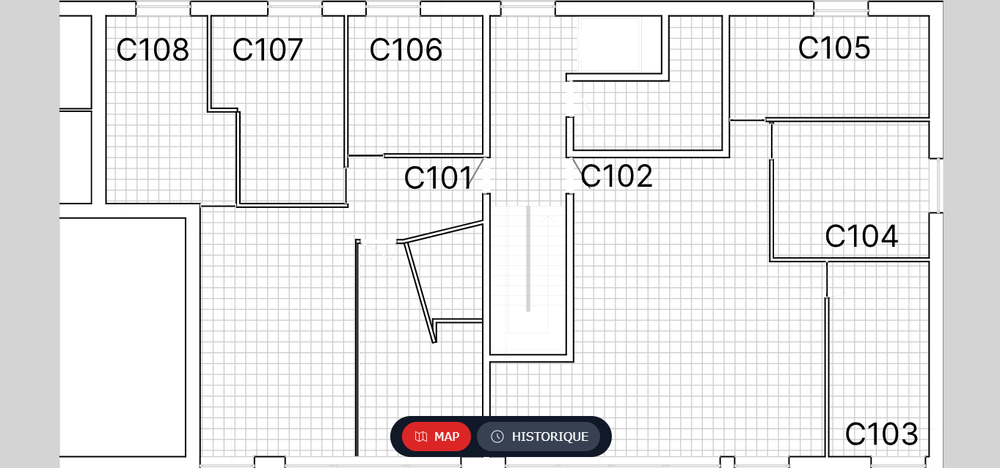

   - **Zoom sur des zones spécifiques** : Utilisez le zoom pour vous concentrer sur une salle ou une zone particulière.

   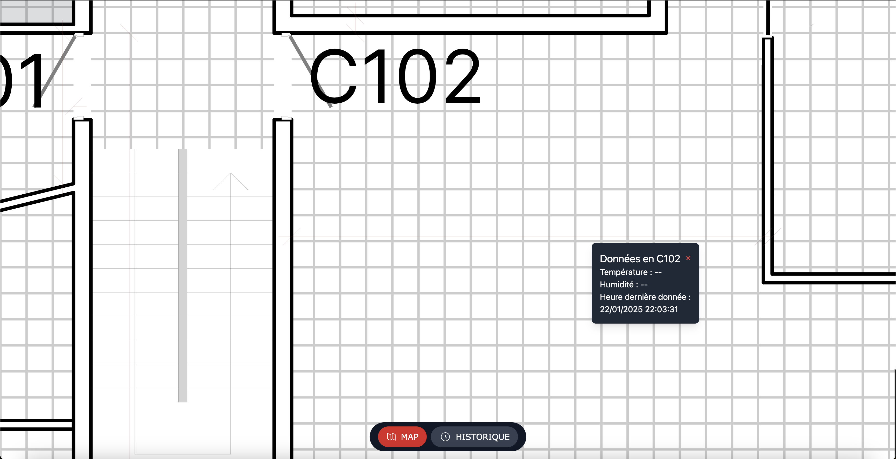

   - **Affichage des informations sur les salles via des pop-up** : Lorsqu'une salle est survolée (grisée), une fenêtre contextuelle (pop-up) s'affiche avec les données en temps réel des capteurs : température, humidité, et l'heure des dernières données captées. Cela permet de suivre l'état actuel des capteurs sans avoir à aller dans les détails.

   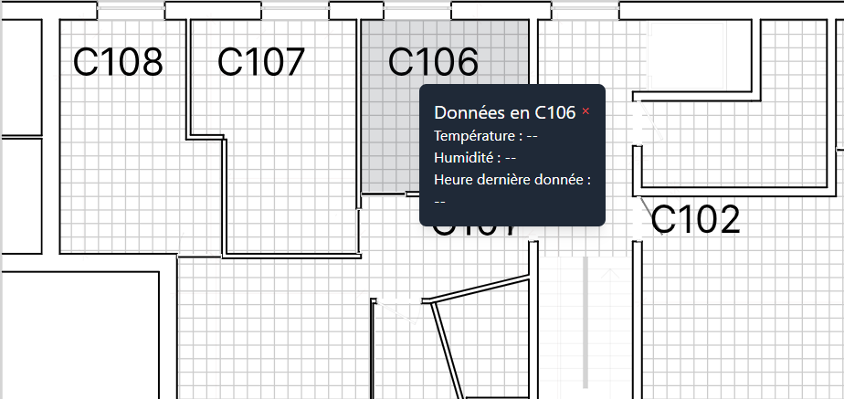

   - **Affichage de l'état des portes** : La carte affiche également l'état des portes (ouvertes ou fermées), basé sur les données des capteurs de contact. 

   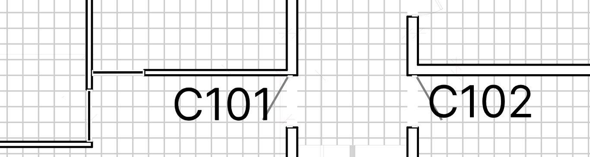

   - **Accès à la page Historique via la barre d'action** : Une barre d'action en bas de la page permet de naviguer entre la carte interactive et la page Historique. Cette barre d'action est présente sur les deux pages.

   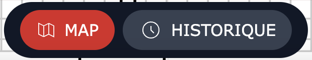
   

### 2. **Page Historique** : 

Disponible à l'adresse suivante : http://localhost:8000/historique 

**FILTRES :**

- **Sélection des salles** : Vous devez d'abord sélectionner une salle avant de pouvoir choisir d'autres critères comme le type de capteur et la plage de dates.


- **Choix des types de capteurs** : Vous pouvez choisir parmi différents types de capteurs :
    - **Current**,
    - **Humidity** (pour les capteurs d'humidité),
    - **Temperature** (pour les capteurs de température),
    - **Contact** (pour l'état des portes, ouvert représenté par un `0` ou fermé représenté par un `1`).
- **Sélection des plages de dates** : Sélectionnez une plage de dates pour visualiser les données historiques dans l'intervalle choisi.

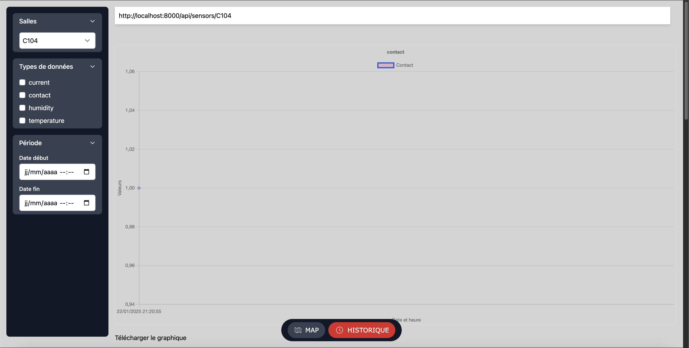

**GRAPHIQUES :**

- **Affichage des données sous forme de graphiques** : Les données sélectionnées sont affichées sous forme de graphiques, avec des options de téléchargement au format PNG (avec fond blanc). 

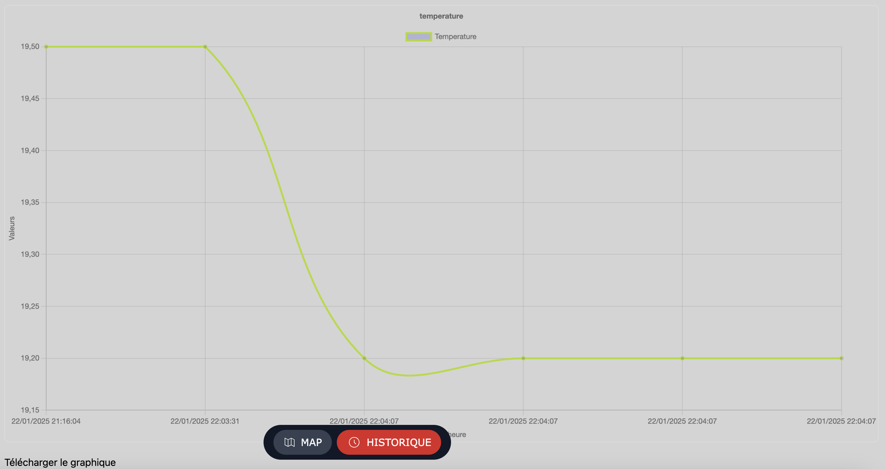
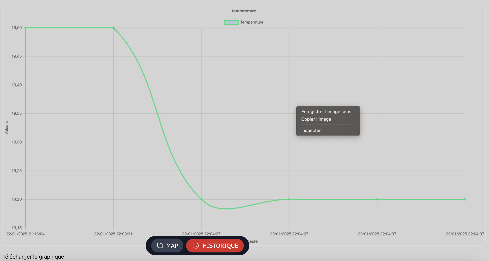

- **Hover sur les graphiques** : En passant la souris sur les points du graphique, les informations détaillées de chaque donnée (comme la température ou l'humidité à un instant donné) apparaissent.

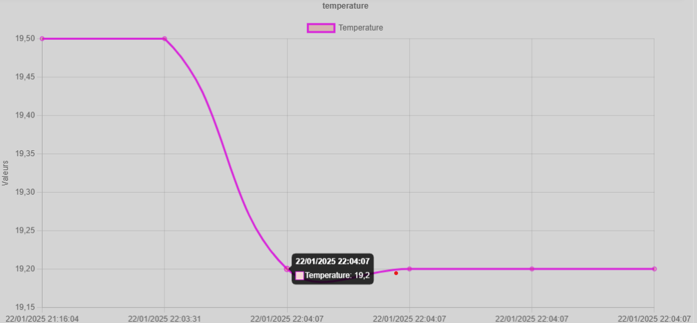


## V. Guide pour ajouter une nouvelle salle dans l'application

**Fichier SVG :**

**1. Ouvrir Figma et importer le fichier SVG**

Ouvrez Figma, créez un nouveau projet, puis effectuez un glisser-déposer du fichier SVG dans ce projet.

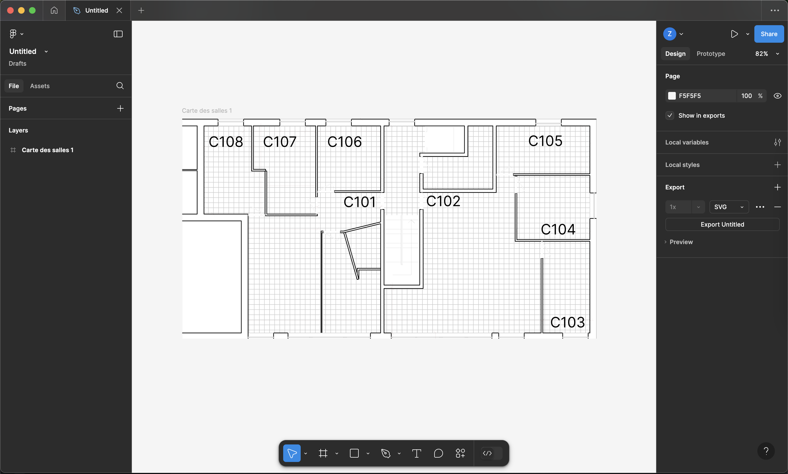

**2. Naviguer vers la layer3**

Une fois le fichier importé, rendez-vous sur la couche (layer) nommée _layer3_.

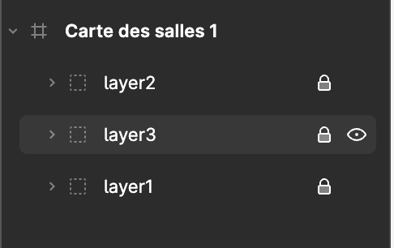
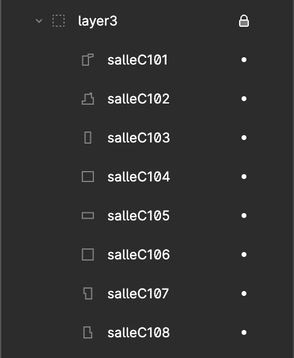

**3. Tracer la délimitation de la salle**

Sélectionnez l'outil _Stylo_, puis tracez les contours de la salle en cliquant pour poser des points (évitez de glisser, car cela créerait des arcs au lieu de lignes droites).

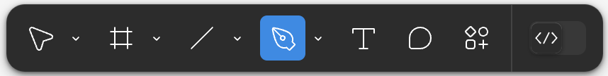

**4. Ajouter le nom ou numéro de la salle**

Pour ajouter le texte correspondant au nom ou numéro de la salle, sélectionnez la couche _layer2_, puis utilisez l'outil _Texte_.

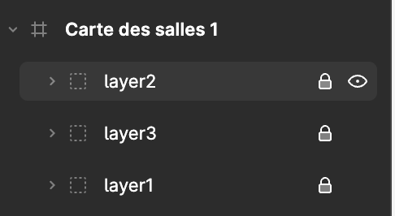
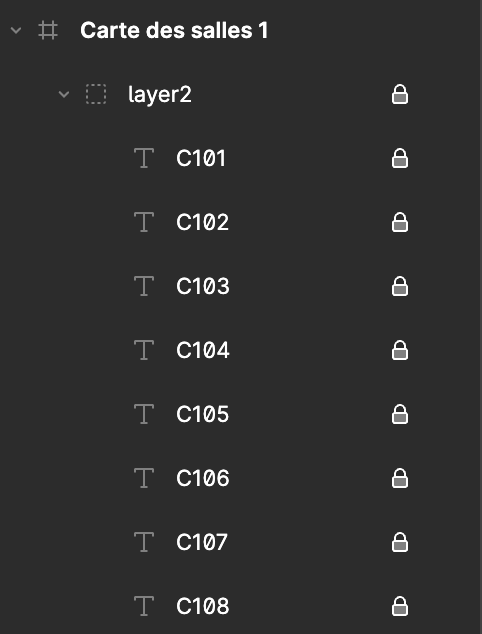

**5. Personnaliser le style**

Ajustez le style du texte ou des tracés selon vos besoins en utilisant les outils disponibles dans la barre latérale droite.

**6. Exporter le fichier**

Une fois les modifications terminées, cliquez sur _Exporter_ et choisissez le format SVG.

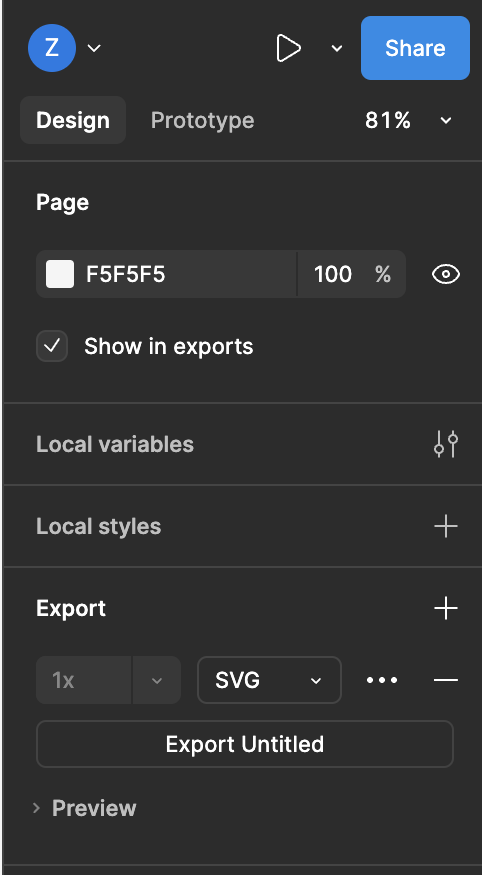

**7. Modifier le fichier SVG**

Ouvrez le fichier SVG exporté avec Notepad++ ou tout autre éditeur de texte. Dans le code, remplacez la balise : ```<svg></svg>``` du fichier ```SAE-ALT-S3-Dev-24-25-DB-Recherche-Equipe-3A02/backend/theme/template/map.html``` par le contenu correspondant de votre fichier SVG. 

**8. Ajout des propriétés pour layer3**

Dans le code, cherchez la balise ```<g></g>``` ayant l’attribut ```id="layer3"```. Cette couche contient toutes les délimitations des espaces. Identifiez les lignes qui n’ont pas les attributs : ```id=salleC\[numeroSalle]Region``` ; ```data-room=C\[numeroSalle]```.
Ajoutez ces deux propriétés en suivant le format des autres salles déjà définies dans le fichier.

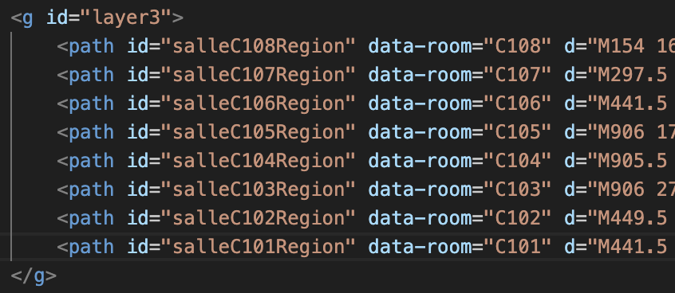
 
---

**Support et Assistance :** Si vous rencontrez un problème, veuillez contacter le support de l'application. 
